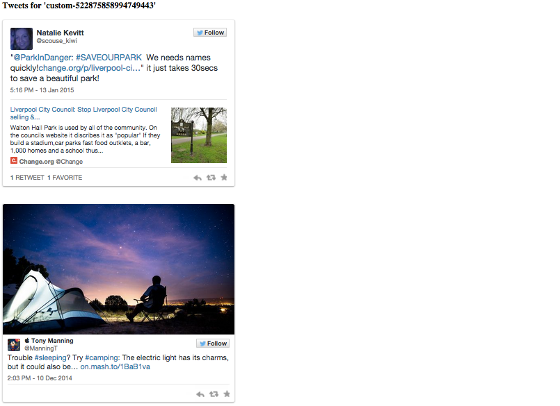

## Collections API Web Server

This is a very small standalone web server written in Java. It shows an end-to-end example of reading a Twitter Collection ID, querying the Collection API and displaying the tweets on a page with widgets.js

This is a fork of the "Simple Webserver" (https://github.com/rafaelsteil/simple-webserver), which in turn is a fork of "Java Mini Web Server" (http://www.jibble.org/miniwebserver).

### Starting the Web Server 

The simplest way to run this sample is from the command line, as such:

	java -classpath 'lib/*:bin' org.jibble.simplewebserver.SimpleWebServer
	
Once the server is running, open a browser to:

	http://localhost:1024/collection/custom-522875858994749443
	
### Development

This sample uses Twitter Collections, which is in Beta and requires additional app permissions. This code ships with default auth tokens, so that developers can being developing and testing immediately. 

If you choose to use this or a derivation for production purposes, contact Twitter directly to enable your app with the Collections Beta permissions. 
 
Also, please note that this is only a demonstration of the Collections API and widgets.js. Deployed to production at scale, it will hit Twitter API rate limits. The end solution should include server-side caching of collections/statuses.

### Licensing

Please see the LICENSE.txt file.